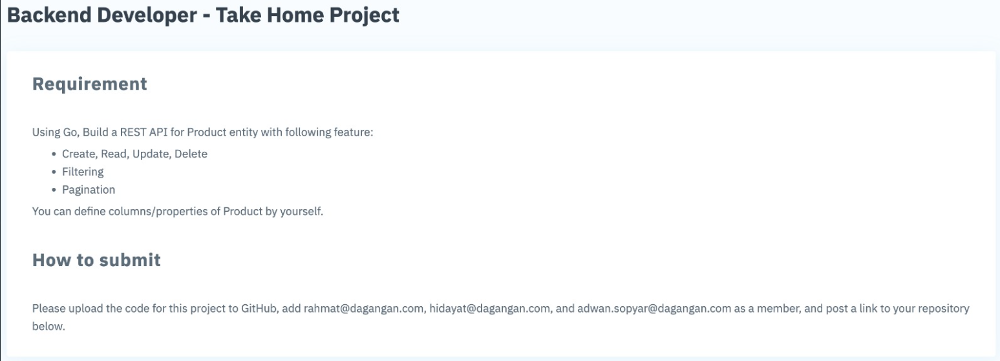

# Golang REST API Dagangan

A RESTful API for Product entity service with GO.

It is just a simple app for recruitment process at dagangan.com

## brief project description



## Installation & Run

```bash
# Download this project
git clone https://github.com/BagusNurhudaUI/dagangan-bagus-nurhuda.git
```

Before runnng the API server on your local, rename file example.env -> .env and fill in every line required for environment.

```go
port :  //127.0.0.1:3000
host     :    // hostname pc
portdb     :   //portdatabase postgres
user     :    // username database
password :     // password database
dbname   :  // database name
```

```bash
# Build and run
cd dagangan-bagus-nurhuda
run go main.go

# API Endpoint : http://127.0.0.1:3000 OR customable port
```

## Field Struct

```go
ID        uint       `gorm:"primaryKey" json:"id"`
Title     string     `gorm:"not null" json:"title" valid:"required~Title is required"`
Caption   string     `json:"caption" valid:"required~Caption is required"`
Price     int64      `json:"price" valid:"required~Price is required"`
Photo_url string     `json:"photo_url" valid:"required~Photo URL is required"`
CreatedAt *time.Time `json:"created_at,omitempty"`
UpdatedAt *time.Time `json:"updated_at,omitempty"`

for post, using Title, Caption, Price and Photo_url in request body
```

## Features

```go
- Pagination :
    - can be configured by page and limit
- Filtering :
    - by searching word in title and caption fields
    - by filtering max price and min price
- sorting :
    - by price ascending & descending

```

## API

#### /

- `GET` : Get Index of home page

#### /products

- `GET` : Get all products with pagination feature
  query parameters :

  - page : page of pagination
  - limit : limit product will be returned each page
  - search : searching word inside product title or caption
  - maxprice : maximum price will be returned
  - minprice : minimum price will be returned
  - sortbyprice :

    - "true" : will order products by price ascending
    - "false" : will order products by price descending

- `POST` : create a new product

#### /products/:productId

- `PUT` : update a product by Id
- `DELETE` : Delete a product by Id
- `GET` : get a product by Id

#### /products/all

- `GET` : Get all list of products
